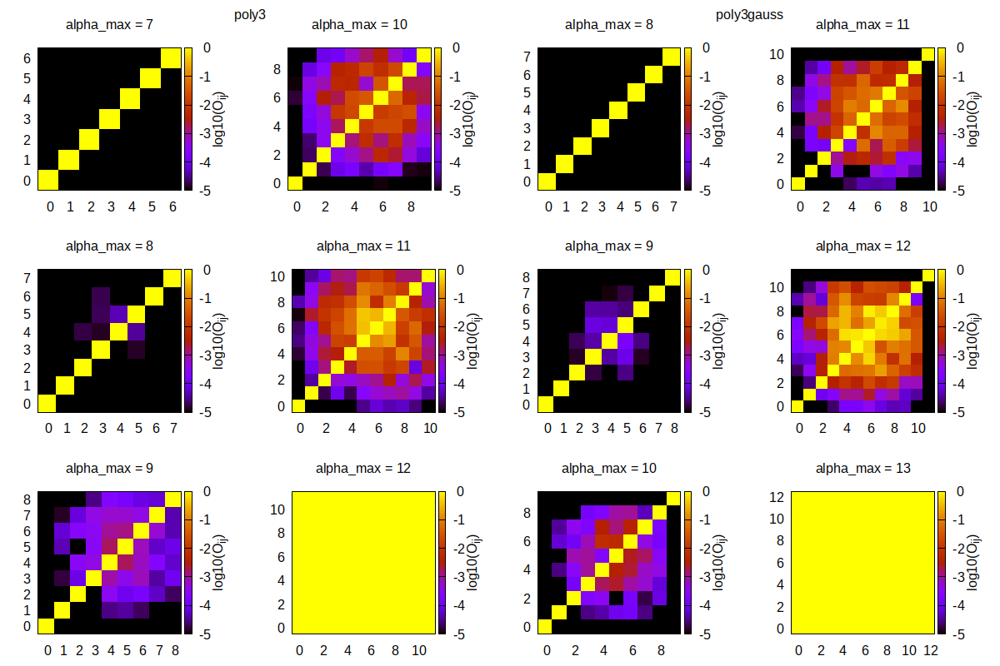

# soap_turbo

## Legal and copyright

**soap_turbo** is copyright (c) 2019-2023, Miguel A. Caro

**soap_turbo** is published and distributed under the
Academic Software License v1.0 (ASL)

**soap_turbo** is distributed in the hope that it will be useful for
non-commercial academic research, but WITHOUT ANY WARRANTY; without even
the implied warranty of MERCHANTABILITY or FITNESS FOR A PARTICULAR
PURPOSE. See the ASL for more details. You should have received a copy
of the ASL along with this program (e.g., in a LICENSE.md file);
if not, you can write to the original licensor, Miguel Caro
(mcaroba@gmail.com). The ASL is also published at
http://github.com/gabor1/ASL

When using this software, please cite the following reference:

>**Miguel A. Caro**. *Optimizing many-body atomic descriptors for enhanced computational
>performance of machine learning based interatomic potentials*. [Phys. Rev. B 100, 024112
>(2019)](https://journals.aps.org/prb/abstract/10.1103/PhysRevB.100.024112).

## About the code

**soap_turbo** comprises a series of libraries to be used in combination
with **QUIP/GAP** and **TurboGAP**.

## Equivalence between soap and soap_turbo

**soap_turbo** is closely related to the original **soap** descriptor implemented in
[GAP](http://github.com/libatoms/GAP) but there are several details in which they
differ, both regarding how the atomic density field is represented and how the expansion
is carried out. Briefly, **soap_turbo** in principle allows very detailed fine-tuning
of the atomic representation through many hyperparameters (about twice as many as in
**soap**) and most of these hyperparameters can be specified, unlike in **soap**,
individually for each species. In practice, one can usually "translate" a **soap**
definition to the **soap_turbo** quasi-equivalent definition. The table below gives
a rough equivalence between **soap** and **soap_turbo** descriptor strings, useful for
users of **gap_fit** and **quippy** who want to migrate their descriptors from **soap**
to **soap_turbo**. A general note for gap_fit usage is that, while for **soap** descriptors arrays are
provided within single brackets, {a b c}, because of the way that **soap_turbo** strings are parsed
they need to be provided within double brackets, {{a b c}}. In quippy single brackets are
enough.

| soap | soap_turbo | Default | Info | Example |
| --- | --- | --- | --- | --- |
| n_max (integer scalar) | alpha_max (integer array) | No default - required | One per species. Should not be > 12 because of numerial instabilities. A maximum of 8 is a safe bet. | alpha_max={{8 8 8}} |
| l_max (integer scalar) | l_max (integer array) | No default - required | | l_max=8 |
| atom_sigma (real scalar) | atom_sigma_r (real array)   atom_sigma_t (real array) | No default - required | One per species. "r" for radial and "t" for angular. | atom_sigma_r={{0.5 0.5 0.5}}   atom_sigma_t={{0.5 0.5 0.5}} |
| n/a | atom_sigma_r_scaling (real array)   atom_sigma_t_scaling (real array) | No default - required | One per species. "r" for radial and "t" for angular. | atom_sigma_r_scaling={{0. 0. 0.}}   atom_sigma_t_scaling={{0. 0. 0.}} |
| n/a | radial_enhancement (integer) | 0 | Can be 0, 1 or 2. | radial_enhancement=1 |
| n/a | amplitude_scaling (real array) | No default - required | Any real, one per species. > 0 and not too large (e.g., not greater than 2-3) makes most sense. | amplitude_scaling={{1. 1. 1.}} |
| central_weight (real) | central_weight (real array) | No default - required | Any real, one per species. > 0 and not too large (e.g., not greater than 2-3) makes most sense. | central_weight={{1. 1. 1.}} |
| n/a | basis (string) | "poly3" | Can be "poly3" (default) or "poly3gauss" | basis="poly3gauss" |
| n/a | compress_mode (string) | "None" | Not required but recommended. Detailed documentation coming up. | compress_mode="trivial" |
| cutoff (real) | rcut_hard (real) | No default - required | | rcut_hard=5.0 |
| transition_width (real) | rcut_soft (real) | No default - required | IMPORTANT: rcut_soft is the rcut_hard - transision_width equivalent. | rcut_soft=4.5 |
| n_scpecies (integer) | n_species (integer) | 1 | | n_species=3 |
| species_Z (integer array) | species_Z (integer array) | No default - required | | species_Z={{1 6 8}} |
| n/a | central_index (integer) | 1 | Position in species_Z array occupied by the central atom species of the SOAP environment. I.e., each soap_turbo definition only sees central species of this type. | central_index=2 |
| add_species (logical) | add_species (logical) | No default - required setting it to F (add add_species=F to your string!) | IMPORTANT: for soap_turbo there is currently no recipe to build the descriptor for all species automatically. It must be explicitly set to false. | add_species=F |

## Numerical instabilities in the poly3 and poly3gauss bases

The `poly3` and `poly3gauss` bases use a numerical orthonormalization procedure that becomes unstable for too
large number of basis functions (see paper(s) linked above for more details). For `poly3` one can safely use
up to 7 basis functions (`alpha_max = {7}`), whereas for `poly3gauss` one can use an extra basis function
(`alpha_max = {8}` is safe to use). The code will print a warning if you go slightly above these values, and
an error if you try to use too many basis functions. Below is a figure showing the matrix elements in the
orthornomality matrix, where O_{ij} gives the overlap integral between basis functions i and j. This number
should be 1 if i=j and 0 otherwise. Results for `poly3` are on the two columns on the left, and for `poly3gauss`
on the two columns on the right. Note the color bar gives the log10 of the matrix elements. For the
recommended `alpha_max` maxima, O_{ij} stays below 10^{-5} for i != j. The procedure becomes increasingly
unstable above that and catastrophically so at `alpha_max = 12, 13` for `poly3` and `poly3gauss`, respectively.

